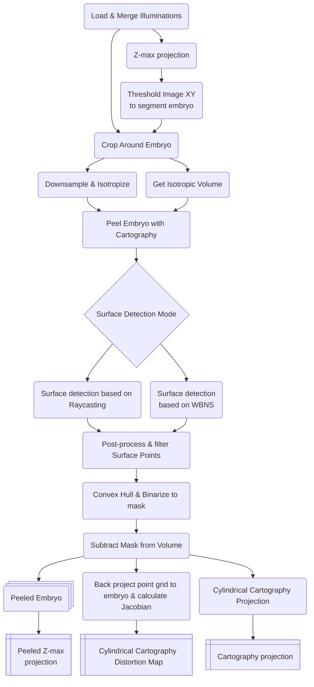

# Peeling of insect embryo surface and cartography in light-sheet microscopy images


## Usage
```bash
python peel_embryo_with_cartography.py <input folder> --output_folder <output folder> --reuse_peeling --wbns_threshold mean
```

## Example outputs

*Cylindrical cartography projection of the surface of a peeled embryo*

## Pipeline flow


### Filtering for embryo structures using WBNS for embryo surface detection


### Erroneous signal removal from filtered embryo structures for surface detection


### Visualization of embryo surface points projection onto cylinder surface for cartography


